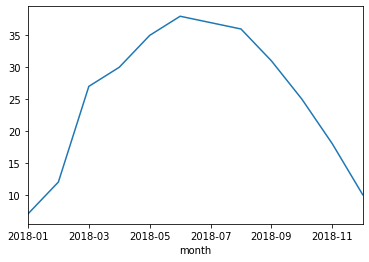
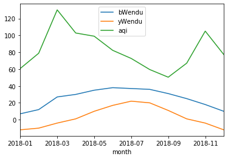

## Pandas怎样实现groupby分组统计

类似SQL：  
select city,max(temperature) from city_weather group by city;

groupby：先对数据分组，然后在每个分组上应用聚合函数、转换函数

本次演示：  
一、分组使用聚合函数做数据统计  
二、遍历groupby的结果理解执行流程  
三、实例分组探索天气数据  


```python
import pandas as pd
import numpy as np
# 加上这一句，能在jupyter notebook展示matplot图表
%matplotlib inline
```


```python
df = pd.DataFrame({'A': ['foo', 'bar', 'foo', 'bar', 'foo', 'bar', 'foo', 'foo'],
                   'B': ['one', 'one', 'two', 'three', 'two', 'two', 'one', 'three'],
                   'C': np.random.randn(8),
                   'D': np.random.randn(8)})
df
```


<table border="1" class="dataframe">
  <thead>
    <tr style="text-align: right;">
      <th></th>
      <th>A</th>
      <th>B</th>
      <th>C</th>
      <th>D</th>
    </tr>
  </thead>
  <tbody>
    <tr>
      <td>0</td>
      <td>foo</td>
      <td>one</td>
      <td>0.542903</td>
      <td>0.788896</td>
    </tr>
    <tr>
      <td>1</td>
      <td>bar</td>
      <td>one</td>
      <td>-0.375789</td>
      <td>-0.345869</td>
    </tr>
    <tr>
      <td>2</td>
      <td>foo</td>
      <td>two</td>
      <td>-0.903407</td>
      <td>0.428031</td>
    </tr>
    <tr>
      <td>3</td>
      <td>bar</td>
      <td>three</td>
      <td>-1.564748</td>
      <td>0.081163</td>
    </tr>
    <tr>
      <td>4</td>
      <td>foo</td>
      <td>two</td>
      <td>-1.093602</td>
      <td>0.837348</td>
    </tr>
    <tr>
      <td>5</td>
      <td>bar</td>
      <td>two</td>
      <td>-0.202403</td>
      <td>0.701301</td>
    </tr>
    <tr>
      <td>6</td>
      <td>foo</td>
      <td>one</td>
      <td>-0.665189</td>
      <td>-1.505290</td>
    </tr>
    <tr>
      <td>7</td>
      <td>foo</td>
      <td>three</td>
      <td>-0.498339</td>
      <td>0.534438</td>
    </tr>
  </tbody>
</table>


### 一、分组使用聚合函数做数据统计

#### 1、单个列groupby，查询所有数据列的统计


```python
df.groupby('A').sum()
```


<table border="1" class="dataframe">
  <thead>
    <tr style="text-align: right;">
      <th></th>
      <th>C</th>
      <th>D</th>
    </tr>
    <tr>
      <th>A</th>
      <th></th>
      <th></th>
    </tr>
  </thead>
  <tbody>
    <tr>
      <td>bar</td>
      <td>-2.142940</td>
      <td>0.436595</td>
    </tr>
    <tr>
      <td>foo</td>
      <td>-2.617633</td>
      <td>1.083423</td>
    </tr>
  </tbody>
</table>


我们看到：
1. groupby中的'A'变成了数据的索引列
2. 因为要统计sum，但B列不是数字，所以被自动忽略掉

#### 2、多个列groupby，查询所有数据列的统计


```python
df.groupby(['A','B']).mean()
```


<table border="1" class="dataframe">
  <thead>
    <tr style="text-align: right;">
      <th></th>
      <th></th>
      <th>C</th>
      <th>D</th>
    </tr>
    <tr>
      <th>A</th>
      <th>B</th>
      <th></th>
      <th></th>
    </tr>
  </thead>
  <tbody>
    <tr>
      <td rowspan="3" valign="top">bar</td>
      <td>one</td>
      <td>-0.375789</td>
      <td>-0.345869</td>
    </tr>
    <tr>
      <td>three</td>
      <td>-1.564748</td>
      <td>0.081163</td>
    </tr>
    <tr>
      <td>two</td>
      <td>-0.202403</td>
      <td>0.701301</td>
    </tr>
    <tr>
      <td rowspan="3" valign="top">foo</td>
      <td>one</td>
      <td>-0.061143</td>
      <td>-0.358197</td>
    </tr>
    <tr>
      <td>three</td>
      <td>-0.498339</td>
      <td>0.534438</td>
    </tr>
    <tr>
      <td>two</td>
      <td>-0.998504</td>
      <td>0.632690</td>
    </tr>
  </tbody>
</table>


我们看到：('A','B')成对变成了二级索引


```python
df.groupby(['A','B'], as_index=False).mean()
```


<table border="1" class="dataframe">
  <thead>
    <tr style="text-align: right;">
      <th></th>
      <th>A</th>
      <th>B</th>
      <th>C</th>
      <th>D</th>
    </tr>
  </thead>
  <tbody>
    <tr>
      <td>0</td>
      <td>bar</td>
      <td>one</td>
      <td>-0.375789</td>
      <td>-0.345869</td>
    </tr>
    <tr>
      <td>1</td>
      <td>bar</td>
      <td>three</td>
      <td>-1.564748</td>
      <td>0.081163</td>
    </tr>
    <tr>
      <td>2</td>
      <td>bar</td>
      <td>two</td>
      <td>-0.202403</td>
      <td>0.701301</td>
    </tr>
    <tr>
      <td>3</td>
      <td>foo</td>
      <td>one</td>
      <td>-0.061143</td>
      <td>-0.358197</td>
    </tr>
    <tr>
      <td>4</td>
      <td>foo</td>
      <td>three</td>
      <td>-0.498339</td>
      <td>0.534438</td>
    </tr>
    <tr>
      <td>5</td>
      <td>foo</td>
      <td>two</td>
      <td>-0.998504</td>
      <td>0.632690</td>
    </tr>
  </tbody>
</table>


#### 3、同时查看多种数据统计


```python
df.groupby('A').agg([np.sum, np.mean, np.std])
```

<table border="1" class="dataframe">
  <thead>
    <tr>
      <th></th>
      <th colspan="3" halign="left">C</th>
      <th colspan="3" halign="left">D</th>
    </tr>
    <tr>
      <th></th>
      <th>sum</th>
      <th>mean</th>
      <th>std</th>
      <th>sum</th>
      <th>mean</th>
      <th>std</th>
    </tr>
    <tr>
      <th>A</th>
      <th></th>
      <th></th>
      <th></th>
      <th></th>
      <th></th>
      <th></th>
    </tr>
  </thead>
  <tbody>
    <tr>
      <td>bar</td>
      <td>-2.142940</td>
      <td>-0.714313</td>
      <td>0.741583</td>
      <td>0.436595</td>
      <td>0.145532</td>
      <td>0.526544</td>
    </tr>
    <tr>
      <td>foo</td>
      <td>-2.617633</td>
      <td>-0.523527</td>
      <td>0.637822</td>
      <td>1.083423</td>
      <td>0.216685</td>
      <td>0.977686</td>
    </tr>
  </tbody>
</table>


我们看到：列变成了多级索引

#### 4、查看单列的结果数据统计


```python
# 方法1：预过滤，性能更好
df.groupby('A')['C'].agg([np.sum, np.mean, np.std])
```


<table border="1" class="dataframe">
  <thead>
    <tr style="text-align: right;">
      <th></th>
      <th>sum</th>
      <th>mean</th>
      <th>std</th>
    </tr>
    <tr>
      <th>A</th>
      <th></th>
      <th></th>
      <th></th>
    </tr>
  </thead>
  <tbody>
    <tr>
      <td>bar</td>
      <td>-2.142940</td>
      <td>-0.714313</td>
      <td>0.741583</td>
    </tr>
    <tr>
      <td>foo</td>
      <td>-2.617633</td>
      <td>-0.523527</td>
      <td>0.637822</td>
    </tr>
  </tbody>
</table>


```python
# 方法2
df.groupby('A').agg([np.sum, np.mean, np.std])['C']
```


<table border="1" class="dataframe">
  <thead>
    <tr style="text-align: right;">
      <th></th>
      <th>sum</th>
      <th>mean</th>
      <th>std</th>
    </tr>
    <tr>
      <th>A</th>
      <th></th>
      <th></th>
      <th></th>
    </tr>
  </thead>
  <tbody>
    <tr>
      <td>bar</td>
      <td>-2.142940</td>
      <td>-0.714313</td>
      <td>0.741583</td>
    </tr>
    <tr>
      <td>foo</td>
      <td>-2.617633</td>
      <td>-0.523527</td>
      <td>0.637822</td>
    </tr>
  </tbody>
</table>


#### 5、不同列使用不同的聚合函数


```python
df.groupby('A').agg({"C":np.sum, "D":np.mean})
```


<table border="1" class="dataframe">
  <thead>
    <tr style="text-align: right;">
      <th></th>
      <th>C</th>
      <th>D</th>
    </tr>
    <tr>
      <th>A</th>
      <th></th>
      <th></th>
    </tr>
  </thead>
  <tbody>
    <tr>
      <td>bar</td>
      <td>-2.142940</td>
      <td>0.145532</td>
    </tr>
    <tr>
      <td>foo</td>
      <td>-2.617633</td>
      <td>0.216685</td>
    </tr>
  </tbody>
</table>


### 二、遍历groupby的结果理解执行流程

for循环可以直接遍历每个group

##### 1、遍历单个列聚合的分组


```python
g = df.groupby('A')
g
```


    <pandas.core.groupby.generic.DataFrameGroupBy object at 0x00000123B250E548>


```python
for name,group in g:
    print(name)
    print(group)
    print()
```

    bar
         A      B         C         D
    1  bar    one -0.375789 -0.345869
    3  bar  three -1.564748  0.081163
    5  bar    two -0.202403  0.701301
    
    foo
         A      B         C         D
    0  foo    one  0.542903  0.788896
    2  foo    two -0.903407  0.428031
    4  foo    two -1.093602  0.837348
    6  foo    one -0.665189 -1.505290
    7  foo  three -0.498339  0.534438


​    

***可以获取单个分组的数据***


```python
g.get_group('bar')
```


<table border="1" class="dataframe">
  <thead>
    <tr style="text-align: right;">
      <th></th>
      <th>A</th>
      <th>B</th>
      <th>C</th>
      <th>D</th>
    </tr>
  </thead>
  <tbody>
    <tr>
      <td>1</td>
      <td>bar</td>
      <td>one</td>
      <td>-0.375789</td>
      <td>-0.345869</td>
    </tr>
    <tr>
      <td>3</td>
      <td>bar</td>
      <td>three</td>
      <td>-1.564748</td>
      <td>0.081163</td>
    </tr>
    <tr>
      <td>5</td>
      <td>bar</td>
      <td>two</td>
      <td>-0.202403</td>
      <td>0.701301</td>
    </tr>
  </tbody>
</table>


##### 2、遍历多个列聚合的分组


```python
g = df.groupby(['A', 'B'])
```


```python
for name,group in g:
    print(name)
    print(group)
    print()
```

    ('bar', 'one')
         A    B         C         D
    1  bar  one -0.375789 -0.345869
    
    ('bar', 'three')
         A      B         C         D
    3  bar  three -1.564748  0.081163
    
    ('bar', 'two')
         A    B         C         D
    5  bar  two -0.202403  0.701301
    
    ('foo', 'one')
         A    B         C         D
    0  foo  one  0.542903  0.788896
    6  foo  one -0.665189 -1.505290
    
    ('foo', 'three')
         A      B         C         D
    7  foo  three -0.498339  0.534438
    
    ('foo', 'two')
         A    B         C         D
    2  foo  two -0.903407  0.428031
    4  foo  two -1.093602  0.837348


​    

可以看到，name是一个2个元素的tuple，代表不同的列


```python
g.get_group(('foo', 'one'))
```


<div>
<style scoped>
    .dataframe tbody tr th:only-of-type {
        vertical-align: middle;
    }

    .dataframe tbody tr th {
        vertical-align: top;
    }
    
    .dataframe thead th {
        text-align: right;
    }
</style>
<table border="1" class="dataframe">
  <thead>
    <tr style="text-align: right;">
      <th></th>
      <th>A</th>
      <th>B</th>
      <th>C</th>
      <th>D</th>
    </tr>
  </thead>
  <tbody>
    <tr>
      <td>0</td>
      <td>foo</td>
      <td>one</td>
      <td>0.542903</td>
      <td>0.788896</td>
    </tr>
    <tr>
      <td>6</td>
      <td>foo</td>
      <td>one</td>
      <td>-0.665189</td>
      <td>-1.505290</td>
    </tr>
  </tbody>
</table>
</div>


***可以直接查询group后的某几列，生成Series或者子DataFrame***


```python
g['C']
```


    <pandas.core.groupby.generic.SeriesGroupBy object at 0x00000123C33F64C8>


```python
for name, group in g['C']:
    print(name)
    print(group)
    print(type(group))
    print()
```

    ('bar', 'one')
    1   -0.375789
    Name: C, dtype: float64
    <class 'pandas.core.series.Series'>
    
    ('bar', 'three')
    3   -1.564748
    Name: C, dtype: float64
    <class 'pandas.core.series.Series'>
    
    ('bar', 'two')
    5   -0.202403
    Name: C, dtype: float64
    <class 'pandas.core.series.Series'>
    
    ('foo', 'one')
    0    0.542903
    6   -0.665189
    Name: C, dtype: float64
    <class 'pandas.core.series.Series'>
    
    ('foo', 'three')
    7   -0.498339
    Name: C, dtype: float64
    <class 'pandas.core.series.Series'>
    
    ('foo', 'two')
    2   -0.903407
    4   -1.093602
    Name: C, dtype: float64
    <class 'pandas.core.series.Series'>


​    

其实所有的聚合统计，都是在dataframe和series上进行的；

### 三、实例分组探索天气数据


```python
fpath = "./datas/beijing_tianqi/beijing_tianqi_2018.csv"
df = pd.read_csv(fpath)
# 替换掉温度的后缀℃
df.loc[:, "bWendu"] = df["bWendu"].str.replace("℃", "").astype('int32')
df.loc[:, "yWendu"] = df["yWendu"].str.replace("℃", "").astype('int32')
df.head()
```


<div>
<style scoped>
    .dataframe tbody tr th:only-of-type {
        vertical-align: middle;
    }

    .dataframe tbody tr th {
        vertical-align: top;
    }
    
    .dataframe thead th {
        text-align: right;
    }
</style>
<table border="1" class="dataframe">
  <thead>
    <tr style="text-align: right;">
      <th></th>
      <th>ymd</th>
      <th>bWendu</th>
      <th>yWendu</th>
      <th>tianqi</th>
      <th>fengxiang</th>
      <th>fengli</th>
      <th>aqi</th>
      <th>aqiInfo</th>
      <th>aqiLevel</th>
    </tr>
  </thead>
  <tbody>
    <tr>
      <td>0</td>
      <td>2018-01-01</td>
      <td>3</td>
      <td>-6</td>
      <td>晴~多云</td>
      <td>东北风</td>
      <td>1-2级</td>
      <td>59</td>
      <td>良</td>
      <td>2</td>
    </tr>
    <tr>
      <td>1</td>
      <td>2018-01-02</td>
      <td>2</td>
      <td>-5</td>
      <td>阴~多云</td>
      <td>东北风</td>
      <td>1-2级</td>
      <td>49</td>
      <td>优</td>
      <td>1</td>
    </tr>
    <tr>
      <td>2</td>
      <td>2018-01-03</td>
      <td>2</td>
      <td>-5</td>
      <td>多云</td>
      <td>北风</td>
      <td>1-2级</td>
      <td>28</td>
      <td>优</td>
      <td>1</td>
    </tr>
    <tr>
      <td>3</td>
      <td>2018-01-04</td>
      <td>0</td>
      <td>-8</td>
      <td>阴</td>
      <td>东北风</td>
      <td>1-2级</td>
      <td>28</td>
      <td>优</td>
      <td>1</td>
    </tr>
    <tr>
      <td>4</td>
      <td>2018-01-05</td>
      <td>3</td>
      <td>-6</td>
      <td>多云~晴</td>
      <td>西北风</td>
      <td>1-2级</td>
      <td>50</td>
      <td>优</td>
      <td>1</td>
    </tr>
  </tbody>
</table>
</div>


```python
# 新增一列为月份
df['month'] = df['ymd'].str[:7]
df.head()
```


<div>
<style scoped>
    .dataframe tbody tr th:only-of-type {
        vertical-align: middle;
    }

    .dataframe tbody tr th {
        vertical-align: top;
    }
    
    .dataframe thead th {
        text-align: right;
    }
</style>
<table border="1" class="dataframe">
  <thead>
    <tr style="text-align: right;">
      <th></th>
      <th>ymd</th>
      <th>bWendu</th>
      <th>yWendu</th>
      <th>tianqi</th>
      <th>fengxiang</th>
      <th>fengli</th>
      <th>aqi</th>
      <th>aqiInfo</th>
      <th>aqiLevel</th>
      <th>month</th>
    </tr>
  </thead>
  <tbody>
    <tr>
      <td>0</td>
      <td>2018-01-01</td>
      <td>3</td>
      <td>-6</td>
      <td>晴~多云</td>
      <td>东北风</td>
      <td>1-2级</td>
      <td>59</td>
      <td>良</td>
      <td>2</td>
      <td>2018-01</td>
    </tr>
    <tr>
      <td>1</td>
      <td>2018-01-02</td>
      <td>2</td>
      <td>-5</td>
      <td>阴~多云</td>
      <td>东北风</td>
      <td>1-2级</td>
      <td>49</td>
      <td>优</td>
      <td>1</td>
      <td>2018-01</td>
    </tr>
    <tr>
      <td>2</td>
      <td>2018-01-03</td>
      <td>2</td>
      <td>-5</td>
      <td>多云</td>
      <td>北风</td>
      <td>1-2级</td>
      <td>28</td>
      <td>优</td>
      <td>1</td>
      <td>2018-01</td>
    </tr>
    <tr>
      <td>3</td>
      <td>2018-01-04</td>
      <td>0</td>
      <td>-8</td>
      <td>阴</td>
      <td>东北风</td>
      <td>1-2级</td>
      <td>28</td>
      <td>优</td>
      <td>1</td>
      <td>2018-01</td>
    </tr>
    <tr>
      <td>4</td>
      <td>2018-01-05</td>
      <td>3</td>
      <td>-6</td>
      <td>多云~晴</td>
      <td>西北风</td>
      <td>1-2级</td>
      <td>50</td>
      <td>优</td>
      <td>1</td>
      <td>2018-01</td>
    </tr>
  </tbody>
</table>
</div>


#### 1、查看每个月的最高温度


```python
data = df.groupby('month')['bWendu'].max()
data
```


    month
    2018-01     7
    2018-02    12
    2018-03    27
    2018-04    30
    2018-05    35
    2018-06    38
    2018-07    37
    2018-08    36
    2018-09    31
    2018-10    25
    2018-11    18
    2018-12    10
    Name: bWendu, dtype: int32


```python
type(data)
```


    pandas.core.series.Series


```python
data.plot()
```


    <matplotlib.axes._subplots.AxesSubplot at 0x123c344b308>


​    

​    


#### 2、查看每个月的最高温度、最低温度、平均空气质量指数


```python
df.head()
```


<div>
<style scoped>
    .dataframe tbody tr th:only-of-type {
        vertical-align: middle;
    }

    .dataframe tbody tr th {
        vertical-align: top;
    }
    
    .dataframe thead th {
        text-align: right;
    }
</style>
<table border="1" class="dataframe">
  <thead>
    <tr style="text-align: right;">
      <th></th>
      <th>ymd</th>
      <th>bWendu</th>
      <th>yWendu</th>
      <th>tianqi</th>
      <th>fengxiang</th>
      <th>fengli</th>
      <th>aqi</th>
      <th>aqiInfo</th>
      <th>aqiLevel</th>
      <th>month</th>
    </tr>
  </thead>
  <tbody>
    <tr>
      <td>0</td>
      <td>2018-01-01</td>
      <td>3</td>
      <td>-6</td>
      <td>晴~多云</td>
      <td>东北风</td>
      <td>1-2级</td>
      <td>59</td>
      <td>良</td>
      <td>2</td>
      <td>2018-01</td>
    </tr>
    <tr>
      <td>1</td>
      <td>2018-01-02</td>
      <td>2</td>
      <td>-5</td>
      <td>阴~多云</td>
      <td>东北风</td>
      <td>1-2级</td>
      <td>49</td>
      <td>优</td>
      <td>1</td>
      <td>2018-01</td>
    </tr>
    <tr>
      <td>2</td>
      <td>2018-01-03</td>
      <td>2</td>
      <td>-5</td>
      <td>多云</td>
      <td>北风</td>
      <td>1-2级</td>
      <td>28</td>
      <td>优</td>
      <td>1</td>
      <td>2018-01</td>
    </tr>
    <tr>
      <td>3</td>
      <td>2018-01-04</td>
      <td>0</td>
      <td>-8</td>
      <td>阴</td>
      <td>东北风</td>
      <td>1-2级</td>
      <td>28</td>
      <td>优</td>
      <td>1</td>
      <td>2018-01</td>
    </tr>
    <tr>
      <td>4</td>
      <td>2018-01-05</td>
      <td>3</td>
      <td>-6</td>
      <td>多云~晴</td>
      <td>西北风</td>
      <td>1-2级</td>
      <td>50</td>
      <td>优</td>
      <td>1</td>
      <td>2018-01</td>
    </tr>
  </tbody>
</table>
</div>


```python
group_data = df.groupby('month').agg({"bWendu":np.max, "yWendu":np.min, "aqi":np.mean})
group_data
```


<div>
<style scoped>
    .dataframe tbody tr th:only-of-type {
        vertical-align: middle;
    }

    .dataframe tbody tr th {
        vertical-align: top;
    }
    
    .dataframe thead th {
        text-align: right;
    }
</style>
<table border="1" class="dataframe">
  <thead>
    <tr style="text-align: right;">
      <th></th>
      <th>bWendu</th>
      <th>yWendu</th>
      <th>aqi</th>
    </tr>
    <tr>
      <th>month</th>
      <th></th>
      <th></th>
      <th></th>
    </tr>
  </thead>
  <tbody>
    <tr>
      <td>2018-01</td>
      <td>7</td>
      <td>-12</td>
      <td>60.677419</td>
    </tr>
    <tr>
      <td>2018-02</td>
      <td>12</td>
      <td>-10</td>
      <td>78.857143</td>
    </tr>
    <tr>
      <td>2018-03</td>
      <td>27</td>
      <td>-4</td>
      <td>130.322581</td>
    </tr>
    <tr>
      <td>2018-04</td>
      <td>30</td>
      <td>1</td>
      <td>102.866667</td>
    </tr>
    <tr>
      <td>2018-05</td>
      <td>35</td>
      <td>10</td>
      <td>99.064516</td>
    </tr>
    <tr>
      <td>2018-06</td>
      <td>38</td>
      <td>17</td>
      <td>82.300000</td>
    </tr>
    <tr>
      <td>2018-07</td>
      <td>37</td>
      <td>22</td>
      <td>72.677419</td>
    </tr>
    <tr>
      <td>2018-08</td>
      <td>36</td>
      <td>20</td>
      <td>59.516129</td>
    </tr>
    <tr>
      <td>2018-09</td>
      <td>31</td>
      <td>11</td>
      <td>50.433333</td>
    </tr>
    <tr>
      <td>2018-10</td>
      <td>25</td>
      <td>1</td>
      <td>67.096774</td>
    </tr>
    <tr>
      <td>2018-11</td>
      <td>18</td>
      <td>-4</td>
      <td>105.100000</td>
    </tr>
    <tr>
      <td>2018-12</td>
      <td>10</td>
      <td>-12</td>
      <td>77.354839</td>
    </tr>
  </tbody>
</table>
</div>


```python
group_data.plot()
```


    <matplotlib.axes._subplots.AxesSubplot at 0x123c5502d48>


​    

​    


```python

```
