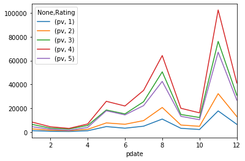
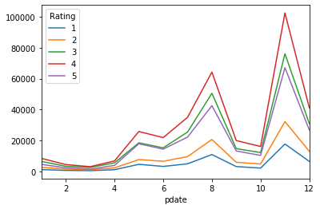

## Pandas的stack和pivot实现数据透视


1. 经过统计得到多维度指标数据
2. 使用unstack实现数据二维透视
3. 使用pivot简化透视
4. stack、unstack、pivot的语法

###  1. 经过统计得到多维度指标数据

非常常见的统计场景，指定多个维度，计算聚合后的指标  

实例：统计得到“电影评分数据集”，每个月份的每个分数被评分多少次：（月份、分数1~5、次数）


```python
import pandas as pd
import numpy as np
%matplotlib inline
```


```python
df = pd.read_csv(
    "./datas/movielens-1m/ratings.dat",
    header=None,
    names="UserID::MovieID::Rating::Timestamp".split("::"),
    sep="::",
    engine="python"
)
```


```python
df.head()
```


<div>
<style scoped>
    .dataframe tbody tr th:only-of-type {
        vertical-align: middle;
    }

    .dataframe tbody tr th {
        vertical-align: top;
    }

    .dataframe thead th {
        text-align: right;
    }
</style>
<table border="1" class="dataframe">
  <thead>
    <tr style="text-align: right;">
      <th></th>
      <th>UserID</th>
      <th>MovieID</th>
      <th>Rating</th>
      <th>Timestamp</th>
    </tr>
  </thead>
  <tbody>
    <tr>
      <td>0</td>
      <td>1</td>
      <td>1193</td>
      <td>5</td>
      <td>978300760</td>
    </tr>
    <tr>
      <td>1</td>
      <td>1</td>
      <td>661</td>
      <td>3</td>
      <td>978302109</td>
    </tr>
    <tr>
      <td>2</td>
      <td>1</td>
      <td>914</td>
      <td>3</td>
      <td>978301968</td>
    </tr>
    <tr>
      <td>3</td>
      <td>1</td>
      <td>3408</td>
      <td>4</td>
      <td>978300275</td>
    </tr>
    <tr>
      <td>4</td>
      <td>1</td>
      <td>2355</td>
      <td>5</td>
      <td>978824291</td>
    </tr>
  </tbody>
</table>
</div>


```python
df["pdate"] = (df["Timestamp"], unit='s')
```


```python
df.head()
```


<div>
<style scoped>
    .dataframe tbody tr th:only-of-type {
        vertical-align: middle;
    }

    .dataframe tbody tr th {
        vertical-align: top;
    }

    .dataframe thead th {
        text-align: right;
    }
</style>
<table border="1" class="dataframe">
  <thead>
    <tr style="text-align: right;">
      <th></th>
      <th>UserID</th>
      <th>MovieID</th>
      <th>Rating</th>
      <th>Timestamp</th>
      <th>pdate</th>
    </tr>
  </thead>
  <tbody>
    <tr>
      <td>0</td>
      <td>1</td>
      <td>1193</td>
      <td>5</td>
      <td>978300760</td>
      <td>2000-12-31 22:12:40</td>
    </tr>
    <tr>
      <td>1</td>
      <td>1</td>
      <td>661</td>
      <td>3</td>
      <td>978302109</td>
      <td>2000-12-31 22:35:09</td>
    </tr>
    <tr>
      <td>2</td>
      <td>1</td>
      <td>914</td>
      <td>3</td>
      <td>978301968</td>
      <td>2000-12-31 22:32:48</td>
    </tr>
    <tr>
      <td>3</td>
      <td>1</td>
      <td>3408</td>
      <td>4</td>
      <td>978300275</td>
      <td>2000-12-31 22:04:35</td>
    </tr>
    <tr>
      <td>4</td>
      <td>1</td>
      <td>2355</td>
      <td>5</td>
      <td>978824291</td>
      <td>2001-01-06 23:38:11</td>
    </tr>
  </tbody>
</table>
</div>


```python
df.dtypes
```


    UserID                int64
    MovieID               int64
    Rating                int64
    Timestamp             int64
    pdate        datetime64[ns]
    dtype: object


```python
# 实现数据统计
df_group = df.groupby([df["pdate"].dt.month, "Rating"])["UserID"].agg(pv=np.size)
```


```python
df_group.head(20)
```


<div>
<style scoped>
    .dataframe tbody tr th:only-of-type {
        vertical-align: middle;
    }

    .dataframe tbody tr th {
        vertical-align: top;
    }

    .dataframe thead th {
        text-align: right;
    }
</style>
<table border="1" class="dataframe">
  <thead>
    <tr style="text-align: right;">
      <th></th>
      <th></th>
      <th>pv</th>
    </tr>
    <tr>
      <th>pdate</th>
      <th>Rating</th>
      <th></th>
    </tr>
  </thead>
  <tbody>
    <tr>
      <td rowspan="5" valign="top">1</td>
      <td>1</td>
      <td>1127</td>
    </tr>
    <tr>
      <td>2</td>
      <td>2608</td>
    </tr>
    <tr>
      <td>3</td>
      <td>6442</td>
    </tr>
    <tr>
      <td>4</td>
      <td>8400</td>
    </tr>
    <tr>
      <td>5</td>
      <td>4495</td>
    </tr>
    <tr>
      <td rowspan="5" valign="top">2</td>
      <td>1</td>
      <td>629</td>
    </tr>
    <tr>
      <td>2</td>
      <td>1464</td>
    </tr>
    <tr>
      <td>3</td>
      <td>3297</td>
    </tr>
    <tr>
      <td>4</td>
      <td>4403</td>
    </tr>
    <tr>
      <td>5</td>
      <td>2335</td>
    </tr>
    <tr>
      <td rowspan="5" valign="top">3</td>
      <td>1</td>
      <td>466</td>
    </tr>
    <tr>
      <td>2</td>
      <td>1077</td>
    </tr>
    <tr>
      <td>3</td>
      <td>2523</td>
    </tr>
    <tr>
      <td>4</td>
      <td>3032</td>
    </tr>
    <tr>
      <td>5</td>
      <td>1439</td>
    </tr>
    <tr>
      <td rowspan="5" valign="top">4</td>
      <td>1</td>
      <td>1048</td>
    </tr>
    <tr>
      <td>2</td>
      <td>2247</td>
    </tr>
    <tr>
      <td>3</td>
      <td>5501</td>
    </tr>
    <tr>
      <td>4</td>
      <td>6748</td>
    </tr>
    <tr>
      <td>5</td>
      <td>3863</td>
    </tr>
  </tbody>
</table>
</div>


```python

```

对这样格式的数据，我想查看按月份，不同评分的次数趋势，是没法实现的

需要将数据变换成每个评分是一列才可以实现

### 2. 使用unstack实现数据二维透视

目的：想要画图对比按照月份的不同评分的数量趋势


```python
df_stack = df_group.unstack()
df_stack
```


<div>
<style scoped>
    .dataframe tbody tr th:only-of-type {
        vertical-align: middle;
    }

    .dataframe tbody tr th {
        vertical-align: top;
    }

    .dataframe thead tr th {
        text-align: left;
    }

    .dataframe thead tr:last-of-type th {
        text-align: right;
    }
</style>
<table border="1" class="dataframe">
  <thead>
    <tr>
      <th></th>
      <th colspan="5" halign="left">pv</th>
    </tr>
    <tr>
      <th>Rating</th>
      <th>1</th>
      <th>2</th>
      <th>3</th>
      <th>4</th>
      <th>5</th>
    </tr>
    <tr>
      <th>pdate</th>
      <th></th>
      <th></th>
      <th></th>
      <th></th>
      <th></th>
    </tr>
  </thead>
  <tbody>
    <tr>
      <td>1</td>
      <td>1127</td>
      <td>2608</td>
      <td>6442</td>
      <td>8400</td>
      <td>4495</td>
    </tr>
    <tr>
      <td>2</td>
      <td>629</td>
      <td>1464</td>
      <td>3297</td>
      <td>4403</td>
      <td>2335</td>
    </tr>
    <tr>
      <td>3</td>
      <td>466</td>
      <td>1077</td>
      <td>2523</td>
      <td>3032</td>
      <td>1439</td>
    </tr>
    <tr>
      <td>4</td>
      <td>1048</td>
      <td>2247</td>
      <td>5501</td>
      <td>6748</td>
      <td>3863</td>
    </tr>
    <tr>
      <td>5</td>
      <td>4557</td>
      <td>7631</td>
      <td>18481</td>
      <td>25769</td>
      <td>17840</td>
    </tr>
    <tr>
      <td>6</td>
      <td>3196</td>
      <td>6500</td>
      <td>15211</td>
      <td>21838</td>
      <td>14365</td>
    </tr>
    <tr>
      <td>7</td>
      <td>4891</td>
      <td>9566</td>
      <td>25421</td>
      <td>34957</td>
      <td>22169</td>
    </tr>
    <tr>
      <td>8</td>
      <td>10873</td>
      <td>20597</td>
      <td>50509</td>
      <td>64198</td>
      <td>42497</td>
    </tr>
    <tr>
      <td>9</td>
      <td>3107</td>
      <td>5873</td>
      <td>14702</td>
      <td>19927</td>
      <td>13182</td>
    </tr>
    <tr>
      <td>10</td>
      <td>2121</td>
      <td>4785</td>
      <td>12175</td>
      <td>16095</td>
      <td>10324</td>
    </tr>
    <tr>
      <td>11</td>
      <td>17701</td>
      <td>32202</td>
      <td>76069</td>
      <td>102448</td>
      <td>67041</td>
    </tr>
    <tr>
      <td>12</td>
      <td>6458</td>
      <td>13007</td>
      <td>30866</td>
      <td>41156</td>
      <td>26760</td>
    </tr>
  </tbody>
</table>
</div>


```python
df_stack.plot()
```


    <matplotlib.axes._subplots.AxesSubplot at 0x1ba09b0ce48>


    

    


```python
# unstack和stack是互逆操作
df_stack.stack().head(20)
```


<div>
<style scoped>
    .dataframe tbody tr th:only-of-type {
        vertical-align: middle;
    }

    .dataframe tbody tr th {
        vertical-align: top;
    }

    .dataframe thead th {
        text-align: right;
    }
</style>
<table border="1" class="dataframe">
  <thead>
    <tr style="text-align: right;">
      <th></th>
      <th></th>
      <th>pv</th>
    </tr>
    <tr>
      <th>pdate</th>
      <th>Rating</th>
      <th></th>
    </tr>
  </thead>
  <tbody>
    <tr>
      <td rowspan="5" valign="top">1</td>
      <td>1</td>
      <td>1127</td>
    </tr>
    <tr>
      <td>2</td>
      <td>2608</td>
    </tr>
    <tr>
      <td>3</td>
      <td>6442</td>
    </tr>
    <tr>
      <td>4</td>
      <td>8400</td>
    </tr>
    <tr>
      <td>5</td>
      <td>4495</td>
    </tr>
    <tr>
      <td rowspan="5" valign="top">2</td>
      <td>1</td>
      <td>629</td>
    </tr>
    <tr>
      <td>2</td>
      <td>1464</td>
    </tr>
    <tr>
      <td>3</td>
      <td>3297</td>
    </tr>
    <tr>
      <td>4</td>
      <td>4403</td>
    </tr>
    <tr>
      <td>5</td>
      <td>2335</td>
    </tr>
    <tr>
      <td rowspan="5" valign="top">3</td>
      <td>1</td>
      <td>466</td>
    </tr>
    <tr>
      <td>2</td>
      <td>1077</td>
    </tr>
    <tr>
      <td>3</td>
      <td>2523</td>
    </tr>
    <tr>
      <td>4</td>
      <td>3032</td>
    </tr>
    <tr>
      <td>5</td>
      <td>1439</td>
    </tr>
    <tr>
      <td rowspan="5" valign="top">4</td>
      <td>1</td>
      <td>1048</td>
    </tr>
    <tr>
      <td>2</td>
      <td>2247</td>
    </tr>
    <tr>
      <td>3</td>
      <td>5501</td>
    </tr>
    <tr>
      <td>4</td>
      <td>6748</td>
    </tr>
    <tr>
      <td>5</td>
      <td>3863</td>
    </tr>
  </tbody>
</table>
</div>


### 3. 使用pivot简化透视


```python
df_group.head(20)
```


<div>
<style scoped>
    .dataframe tbody tr th:only-of-type {
        vertical-align: middle;
    }

    .dataframe tbody tr th {
        vertical-align: top;
    }

    .dataframe thead th {
        text-align: right;
    }
</style>
<table border="1" class="dataframe">
  <thead>
    <tr style="text-align: right;">
      <th></th>
      <th></th>
      <th>pv</th>
    </tr>
    <tr>
      <th>pdate</th>
      <th>Rating</th>
      <th></th>
    </tr>
  </thead>
  <tbody>
    <tr>
      <td rowspan="5" valign="top">1</td>
      <td>1</td>
      <td>1127</td>
    </tr>
    <tr>
      <td>2</td>
      <td>2608</td>
    </tr>
    <tr>
      <td>3</td>
      <td>6442</td>
    </tr>
    <tr>
      <td>4</td>
      <td>8400</td>
    </tr>
    <tr>
      <td>5</td>
      <td>4495</td>
    </tr>
    <tr>
      <td rowspan="5" valign="top">2</td>
      <td>1</td>
      <td>629</td>
    </tr>
    <tr>
      <td>2</td>
      <td>1464</td>
    </tr>
    <tr>
      <td>3</td>
      <td>3297</td>
    </tr>
    <tr>
      <td>4</td>
      <td>4403</td>
    </tr>
    <tr>
      <td>5</td>
      <td>2335</td>
    </tr>
    <tr>
      <td rowspan="5" valign="top">3</td>
      <td>1</td>
      <td>466</td>
    </tr>
    <tr>
      <td>2</td>
      <td>1077</td>
    </tr>
    <tr>
      <td>3</td>
      <td>2523</td>
    </tr>
    <tr>
      <td>4</td>
      <td>3032</td>
    </tr>
    <tr>
      <td>5</td>
      <td>1439</td>
    </tr>
    <tr>
      <td rowspan="5" valign="top">4</td>
      <td>1</td>
      <td>1048</td>
    </tr>
    <tr>
      <td>2</td>
      <td>2247</td>
    </tr>
    <tr>
      <td>3</td>
      <td>5501</td>
    </tr>
    <tr>
      <td>4</td>
      <td>6748</td>
    </tr>
    <tr>
      <td>5</td>
      <td>3863</td>
    </tr>
  </tbody>
</table>
</div>


```python
df_reset = df_group.reset_index()
df_reset.head()
```


<div>
<style scoped>
    .dataframe tbody tr th:only-of-type {
        vertical-align: middle;
    }

    .dataframe tbody tr th {
        vertical-align: top;
    }

    .dataframe thead th {
        text-align: right;
    }
</style>
<table border="1" class="dataframe">
  <thead>
    <tr style="text-align: right;">
      <th></th>
      <th>pdate</th>
      <th>Rating</th>
      <th>pv</th>
    </tr>
  </thead>
  <tbody>
    <tr>
      <td>0</td>
      <td>1</td>
      <td>1</td>
      <td>1127</td>
    </tr>
    <tr>
      <td>1</td>
      <td>1</td>
      <td>2</td>
      <td>2608</td>
    </tr>
    <tr>
      <td>2</td>
      <td>1</td>
      <td>3</td>
      <td>6442</td>
    </tr>
    <tr>
      <td>3</td>
      <td>1</td>
      <td>4</td>
      <td>8400</td>
    </tr>
    <tr>
      <td>4</td>
      <td>1</td>
      <td>5</td>
      <td>4495</td>
    </tr>
  </tbody>
</table>
</div>


```python
df_pivot = df_reset.pivot("pdate", "Rating", "pv")
```


```python
df_pivot.head()
```


<div>
<style scoped>
    .dataframe tbody tr th:only-of-type {
        vertical-align: middle;
    }

    .dataframe tbody tr th {
        vertical-align: top;
    }

    .dataframe thead th {
        text-align: right;
    }
</style>
<table border="1" class="dataframe">
  <thead>
    <tr style="text-align: right;">
      <th>Rating</th>
      <th>1</th>
      <th>2</th>
      <th>3</th>
      <th>4</th>
      <th>5</th>
    </tr>
    <tr>
      <th>pdate</th>
      <th></th>
      <th></th>
      <th></th>
      <th></th>
      <th></th>
    </tr>
  </thead>
  <tbody>
    <tr>
      <td>1</td>
      <td>1127</td>
      <td>2608</td>
      <td>6442</td>
      <td>8400</td>
      <td>4495</td>
    </tr>
    <tr>
      <td>2</td>
      <td>629</td>
      <td>1464</td>
      <td>3297</td>
      <td>4403</td>
      <td>2335</td>
    </tr>
    <tr>
      <td>3</td>
      <td>466</td>
      <td>1077</td>
      <td>2523</td>
      <td>3032</td>
      <td>1439</td>
    </tr>
    <tr>
      <td>4</td>
      <td>1048</td>
      <td>2247</td>
      <td>5501</td>
      <td>6748</td>
      <td>3863</td>
    </tr>
    <tr>
      <td>5</td>
      <td>4557</td>
      <td>7631</td>
      <td>18481</td>
      <td>25769</td>
      <td>17840</td>
    </tr>
  </tbody>
</table>
</div>


```python
df_pivot.plot()
```


    <matplotlib.axes._subplots.AxesSubplot at 0x1ba09db6d48>


    

    


***pivot方法相当于对df使用set_index创建分层索引，然后调用unstack***

### 4. stack、unstack、pivot的语法

#### stack：DataFrame.stack(level=-1, dropna=True)，将column变成index，类似把横放的书籍变成竖放

level=-1代表多层索引的最内层，可以通过==0、1、2指定多层索引的对应层


#### unstack：DataFrame.unstack(level=-1, fill_value=None)，将index变成column，类似把竖放的书籍变成横放


#### pivot：DataFrame.pivot(index=None, columns=None, values=None)，指定index、columns、values实现二维透视


