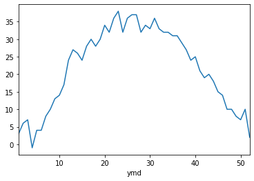
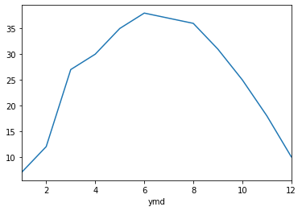
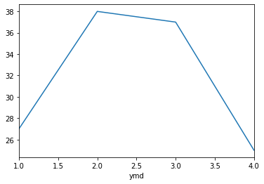

# Pandas怎样快捷方便的处理日期数据

Pandas日期处理的作用：将2018-01-01、1/1/2018等多种日期格式映射成统一的格式对象，在该对象上提供强大的功能支持

几个概念：
1. pd.to_datetime：pandas的一个函数，能将字符串、列表、series变成日期形式
2. Timestamp：pandas表示日期的对象形式
3. DatetimeIndex：pandas表示日期的对象列表形式

其中：
* DatetimeIndex是Timestamp的列表形式
* pd.to_datetime对单个日期字符串处理会得到Timestamp
* pd.to_datetime对日期字符串列表处理会得到DatetimeIndex


### 问题：怎样统计每周、每月、每季度的最高温度？

### 1、读取天气数据到dataframe


```python
import pandas as pd
%matplotlib inline
```


```python
fpath = "./datas/beijing_tianqi/beijing_tianqi_2018.csv"
df = pd.read_csv(fpath)
# 替换掉温度的后缀℃
df.loc[:, "bWendu"] = df["bWendu"].str.replace("℃", "").astype('int32')
df.loc[:, "yWendu"] = df["yWendu"].str.replace("℃", "").astype('int32')
df.head()
```


<div>
<style scoped>
    .dataframe tbody tr th:only-of-type {
        vertical-align: middle;
    }


<table border="1" class="dataframe">
  <thead>
    <tr style="text-align: right;">
      <th></th>
      <th>ymd</th>
      <th>bWendu</th>
      <th>yWendu</th>
      <th>tianqi</th>
      <th>fengxiang</th>
      <th>fengli</th>
      <th>aqi</th>
      <th>aqiInfo</th>
      <th>aqiLevel</th>
    </tr>
  </thead>
  <tbody>
    <tr>
      <td>0</td>
      <td>2018-01-01</td>
      <td>3</td>
      <td>-6</td>
      <td>晴~多云</td>
      <td>东北风</td>
      <td>1-2级</td>
      <td>59</td>
      <td>良</td>
      <td>2</td>
    </tr>
    <tr>
      <td>1</td>
      <td>2018-01-02</td>
      <td>2</td>
      <td>-5</td>
      <td>阴~多云</td>
      <td>东北风</td>
      <td>1-2级</td>
      <td>49</td>
      <td>优</td>
      <td>1</td>
    </tr>
    <tr>
      <td>2</td>
      <td>2018-01-03</td>
      <td>2</td>
      <td>-5</td>
      <td>多云</td>
      <td>北风</td>
      <td>1-2级</td>
      <td>28</td>
      <td>优</td>
      <td>1</td>
    </tr>
    <tr>
      <td>3</td>
      <td>2018-01-04</td>
      <td>0</td>
      <td>-8</td>
      <td>阴</td>
      <td>东北风</td>
      <td>1-2级</td>
      <td>28</td>
      <td>优</td>
      <td>1</td>
    </tr>
    <tr>
      <td>4</td>
      <td>2018-01-05</td>
      <td>3</td>
      <td>-6</td>
      <td>多云~晴</td>
      <td>西北风</td>
      <td>1-2级</td>
      <td>50</td>
      <td>优</td>
      <td>1</td>
    </tr>
  </tbody>
</table>
</div>


### 2、将日期列转换成pandas的日期


```python
df.set_index(pd.to_datetime(df["ymd"]), inplace=True)
```


```python
df.head()
```


<div>
<style scoped>
    .dataframe tbody tr th:only-of-type {
        vertical-align: middle;
    }


<table border="1" class="dataframe">
  <thead>
    <tr style="text-align: right;">
      <th></th>
      <th>ymd</th>
      <th>bWendu</th>
      <th>yWendu</th>
      <th>tianqi</th>
      <th>fengxiang</th>
      <th>fengli</th>
      <th>aqi</th>
      <th>aqiInfo</th>
      <th>aqiLevel</th>
    </tr>
    <tr>
      <th>ymd</th>
      <th></th>
      <th></th>
      <th></th>
      <th></th>
      <th></th>
      <th></th>
      <th></th>
      <th></th>
      <th></th>
    </tr>
  </thead>
  <tbody>
    <tr>
      <td>2018-01-01</td>
      <td>2018-01-01</td>
      <td>3</td>
      <td>-6</td>
      <td>晴~多云</td>
      <td>东北风</td>
      <td>1-2级</td>
      <td>59</td>
      <td>良</td>
      <td>2</td>
    </tr>
    <tr>
      <td>2018-01-02</td>
      <td>2018-01-02</td>
      <td>2</td>
      <td>-5</td>
      <td>阴~多云</td>
      <td>东北风</td>
      <td>1-2级</td>
      <td>49</td>
      <td>优</td>
      <td>1</td>
    </tr>
    <tr>
      <td>2018-01-03</td>
      <td>2018-01-03</td>
      <td>2</td>
      <td>-5</td>
      <td>多云</td>
      <td>北风</td>
      <td>1-2级</td>
      <td>28</td>
      <td>优</td>
      <td>1</td>
    </tr>
    <tr>
      <td>2018-01-04</td>
      <td>2018-01-04</td>
      <td>0</td>
      <td>-8</td>
      <td>阴</td>
      <td>东北风</td>
      <td>1-2级</td>
      <td>28</td>
      <td>优</td>
      <td>1</td>
    </tr>
    <tr>
      <td>2018-01-05</td>
      <td>2018-01-05</td>
      <td>3</td>
      <td>-6</td>
      <td>多云~晴</td>
      <td>西北风</td>
      <td>1-2级</td>
      <td>50</td>
      <td>优</td>
      <td>1</td>
    </tr>
  </tbody>
</table>


```python
df.index
```


    DatetimeIndex(['2018-01-01', '2018-01-02', '2018-01-03', '2018-01-04',
                   '2018-01-05', '2018-01-06', '2018-01-07', '2018-01-08',
                   '2018-01-09', '2018-01-10',
                   ...
                   '2018-12-22', '2018-12-23', '2018-12-24', '2018-12-25',
                   '2018-12-26', '2018-12-27', '2018-12-28', '2018-12-29',
                   '2018-12-30', '2018-12-31'],
                  dtype='datetime64[ns]', name='ymd', length=365, freq=None)


```python
# DatetimeIndex是Timestamp的列表形式
df.index[0]
```


    Timestamp('2018-01-01 00:00:00')


### 3、 方便的对DatetimeIndex进行查询


```python
# 筛选固定的某一天
df.loc['2018-01-05']
```


    ymd          2018-01-05
    bWendu                3
    yWendu               -6
    tianqi             多云~晴
    fengxiang           西北风
    fengli             1-2级
    aqi                  50
    aqiInfo               优
    aqiLevel              1
    Name: 2018-01-05 00:00:00, dtype: object


```python
# 日期区间
df.loc['2018-01-05':'2018-01-10']
```


<div>
<style scoped>
    .dataframe tbody tr th:only-of-type {
        vertical-align: middle;
    }

    .dataframe tbody tr th {
        vertical-align: top;
    }
    
    .dataframe thead th {
        text-align: right;
    }
</style>
<table border="1" class="dataframe">
  <thead>
    <tr style="text-align: right;">
      <th></th>
      <th>ymd</th>
      <th>bWendu</th>
      <th>yWendu</th>
      <th>tianqi</th>
      <th>fengxiang</th>
      <th>fengli</th>
      <th>aqi</th>
      <th>aqiInfo</th>
      <th>aqiLevel</th>
    </tr>
    <tr>
      <th>ymd</th>
      <th></th>
      <th></th>
      <th></th>
      <th></th>
      <th></th>
      <th></th>
      <th></th>
      <th></th>
      <th></th>
    </tr>
  </thead>
  <tbody>
    <tr>
      <td>2018-01-05</td>
      <td>2018-01-05</td>
      <td>3</td>
      <td>-6</td>
      <td>多云~晴</td>
      <td>西北风</td>
      <td>1-2级</td>
      <td>50</td>
      <td>优</td>
      <td>1</td>
    </tr>
    <tr>
      <td>2018-01-06</td>
      <td>2018-01-06</td>
      <td>2</td>
      <td>-5</td>
      <td>多云~阴</td>
      <td>西南风</td>
      <td>1-2级</td>
      <td>32</td>
      <td>优</td>
      <td>1</td>
    </tr>
    <tr>
      <td>2018-01-07</td>
      <td>2018-01-07</td>
      <td>2</td>
      <td>-4</td>
      <td>阴~多云</td>
      <td>西南风</td>
      <td>1-2级</td>
      <td>59</td>
      <td>良</td>
      <td>2</td>
    </tr>
    <tr>
      <td>2018-01-08</td>
      <td>2018-01-08</td>
      <td>2</td>
      <td>-6</td>
      <td>晴</td>
      <td>西北风</td>
      <td>4-5级</td>
      <td>50</td>
      <td>优</td>
      <td>1</td>
    </tr>
    <tr>
      <td>2018-01-09</td>
      <td>2018-01-09</td>
      <td>1</td>
      <td>-8</td>
      <td>晴</td>
      <td>西北风</td>
      <td>3-4级</td>
      <td>34</td>
      <td>优</td>
      <td>1</td>
    </tr>
    <tr>
      <td>2018-01-10</td>
      <td>2018-01-10</td>
      <td>-2</td>
      <td>-10</td>
      <td>晴</td>
      <td>西北风</td>
      <td>1-2级</td>
      <td>26</td>
      <td>优</td>
      <td>1</td>
    </tr>
  </tbody>
</table>
</div>


```python
# 按月份前缀筛选
df.loc['2018-03']
```


<div>
<style scoped>
    .dataframe tbody tr th:only-of-type {
        vertical-align: middle;
    }

    .dataframe tbody tr th {
        vertical-align: top;
    }
    
    .dataframe thead th {
        text-align: right;
    }
</style>
<table border="1" class="dataframe">
  <thead>
    <tr style="text-align: right;">
      <th></th>
      <th>ymd</th>
      <th>bWendu</th>
      <th>yWendu</th>
      <th>tianqi</th>
      <th>fengxiang</th>
      <th>fengli</th>
      <th>aqi</th>
      <th>aqiInfo</th>
      <th>aqiLevel</th>
    </tr>
    <tr>
      <th>ymd</th>
      <th></th>
      <th></th>
      <th></th>
      <th></th>
      <th></th>
      <th></th>
      <th></th>
      <th></th>
      <th></th>
    </tr>
  </thead>
  <tbody>
    <tr>
      <td>2018-03-01</td>
      <td>2018-03-01</td>
      <td>8</td>
      <td>-3</td>
      <td>多云</td>
      <td>西南风</td>
      <td>1-2级</td>
      <td>46</td>
      <td>优</td>
      <td>1</td>
    </tr>
    <tr>
      <td>2018-03-02</td>
      <td>2018-03-02</td>
      <td>9</td>
      <td>-1</td>
      <td>晴~多云</td>
      <td>北风</td>
      <td>1-2级</td>
      <td>95</td>
      <td>良</td>
      <td>2</td>
    </tr>
    <tr>
      <td>2018-03-03</td>
      <td>2018-03-03</td>
      <td>13</td>
      <td>3</td>
      <td>多云~阴</td>
      <td>北风</td>
      <td>1-2级</td>
      <td>214</td>
      <td>重度污染</td>
      <td>5</td>
    </tr>
    <tr>
      <td>2018-03-04</td>
      <td>2018-03-04</td>
      <td>7</td>
      <td>-2</td>
      <td>阴~多云</td>
      <td>东南风</td>
      <td>1-2级</td>
      <td>144</td>
      <td>轻度污染</td>
      <td>3</td>
    </tr>
    <tr>
      <td>2018-03-05</td>
      <td>2018-03-05</td>
      <td>8</td>
      <td>-3</td>
      <td>晴</td>
      <td>南风</td>
      <td>1-2级</td>
      <td>94</td>
      <td>良</td>
      <td>2</td>
    </tr>
    <tr>
      <td>2018-03-06</td>
      <td>2018-03-06</td>
      <td>6</td>
      <td>-3</td>
      <td>多云~阴</td>
      <td>东南风</td>
      <td>3-4级</td>
      <td>67</td>
      <td>良</td>
      <td>2</td>
    </tr>
    <tr>
      <td>2018-03-07</td>
      <td>2018-03-07</td>
      <td>6</td>
      <td>-2</td>
      <td>阴~多云</td>
      <td>北风</td>
      <td>1-2级</td>
      <td>65</td>
      <td>良</td>
      <td>2</td>
    </tr>
    <tr>
      <td>2018-03-08</td>
      <td>2018-03-08</td>
      <td>8</td>
      <td>-4</td>
      <td>晴</td>
      <td>东北风</td>
      <td>1-2级</td>
      <td>62</td>
      <td>良</td>
      <td>2</td>
    </tr>
    <tr>
      <td>2018-03-09</td>
      <td>2018-03-09</td>
      <td>10</td>
      <td>-2</td>
      <td>多云</td>
      <td>西南风</td>
      <td>1-2级</td>
      <td>132</td>
      <td>轻度污染</td>
      <td>3</td>
    </tr>
    <tr>
      <td>2018-03-10</td>
      <td>2018-03-10</td>
      <td>14</td>
      <td>-2</td>
      <td>晴</td>
      <td>东南风</td>
      <td>1-2级</td>
      <td>171</td>
      <td>中度污染</td>
      <td>4</td>
    </tr>
    <tr>
      <td>2018-03-11</td>
      <td>2018-03-11</td>
      <td>11</td>
      <td>0</td>
      <td>多云</td>
      <td>南风</td>
      <td>1-2级</td>
      <td>81</td>
      <td>良</td>
      <td>2</td>
    </tr>
    <tr>
      <td>2018-03-12</td>
      <td>2018-03-12</td>
      <td>15</td>
      <td>3</td>
      <td>多云~晴</td>
      <td>南风</td>
      <td>1-2级</td>
      <td>174</td>
      <td>中度污染</td>
      <td>4</td>
    </tr>
    <tr>
      <td>2018-03-13</td>
      <td>2018-03-13</td>
      <td>17</td>
      <td>5</td>
      <td>晴~多云</td>
      <td>南风</td>
      <td>1-2级</td>
      <td>287</td>
      <td>重度污染</td>
      <td>5</td>
    </tr>
    <tr>
      <td>2018-03-14</td>
      <td>2018-03-14</td>
      <td>15</td>
      <td>6</td>
      <td>多云~阴</td>
      <td>东北风</td>
      <td>1-2级</td>
      <td>293</td>
      <td>重度污染</td>
      <td>5</td>
    </tr>
    <tr>
      <td>2018-03-15</td>
      <td>2018-03-15</td>
      <td>12</td>
      <td>-1</td>
      <td>多云~晴</td>
      <td>东北风</td>
      <td>3-4级</td>
      <td>70</td>
      <td>良</td>
      <td>2</td>
    </tr>
    <tr>
      <td>2018-03-16</td>
      <td>2018-03-16</td>
      <td>10</td>
      <td>-1</td>
      <td>多云</td>
      <td>南风</td>
      <td>1-2级</td>
      <td>58</td>
      <td>良</td>
      <td>2</td>
    </tr>
    <tr>
      <td>2018-03-17</td>
      <td>2018-03-17</td>
      <td>4</td>
      <td>0</td>
      <td>小雨~阴</td>
      <td>南风</td>
      <td>1-2级</td>
      <td>81</td>
      <td>良</td>
      <td>2</td>
    </tr>
    <tr>
      <td>2018-03-18</td>
      <td>2018-03-18</td>
      <td>13</td>
      <td>1</td>
      <td>多云~晴</td>
      <td>西南风</td>
      <td>1-2级</td>
      <td>134</td>
      <td>轻度污染</td>
      <td>3</td>
    </tr>
    <tr>
      <td>2018-03-19</td>
      <td>2018-03-19</td>
      <td>13</td>
      <td>2</td>
      <td>多云</td>
      <td>东风</td>
      <td>1-2级</td>
      <td>107</td>
      <td>轻度污染</td>
      <td>3</td>
    </tr>
    <tr>
      <td>2018-03-20</td>
      <td>2018-03-20</td>
      <td>10</td>
      <td>-2</td>
      <td>多云</td>
      <td>南风</td>
      <td>1-2级</td>
      <td>41</td>
      <td>优</td>
      <td>1</td>
    </tr>
    <tr>
      <td>2018-03-21</td>
      <td>2018-03-21</td>
      <td>11</td>
      <td>1</td>
      <td>多云</td>
      <td>西南风</td>
      <td>1-2级</td>
      <td>76</td>
      <td>良</td>
      <td>2</td>
    </tr>
    <tr>
      <td>2018-03-22</td>
      <td>2018-03-22</td>
      <td>17</td>
      <td>4</td>
      <td>晴~多云</td>
      <td>西南风</td>
      <td>1-2级</td>
      <td>112</td>
      <td>轻度污染</td>
      <td>3</td>
    </tr>
    <tr>
      <td>2018-03-23</td>
      <td>2018-03-23</td>
      <td>18</td>
      <td>5</td>
      <td>多云</td>
      <td>北风</td>
      <td>1-2级</td>
      <td>146</td>
      <td>轻度污染</td>
      <td>3</td>
    </tr>
    <tr>
      <td>2018-03-24</td>
      <td>2018-03-24</td>
      <td>22</td>
      <td>5</td>
      <td>晴</td>
      <td>西南风</td>
      <td>1-2级</td>
      <td>119</td>
      <td>轻度污染</td>
      <td>3</td>
    </tr>
    <tr>
      <td>2018-03-25</td>
      <td>2018-03-25</td>
      <td>24</td>
      <td>7</td>
      <td>晴</td>
      <td>南风</td>
      <td>1-2级</td>
      <td>78</td>
      <td>良</td>
      <td>2</td>
    </tr>
    <tr>
      <td>2018-03-26</td>
      <td>2018-03-26</td>
      <td>25</td>
      <td>7</td>
      <td>多云</td>
      <td>西南风</td>
      <td>1-2级</td>
      <td>151</td>
      <td>中度污染</td>
      <td>4</td>
    </tr>
    <tr>
      <td>2018-03-27</td>
      <td>2018-03-27</td>
      <td>27</td>
      <td>11</td>
      <td>晴</td>
      <td>南风</td>
      <td>1-2级</td>
      <td>243</td>
      <td>重度污染</td>
      <td>5</td>
    </tr>
    <tr>
      <td>2018-03-28</td>
      <td>2018-03-28</td>
      <td>25</td>
      <td>9</td>
      <td>多云~晴</td>
      <td>东风</td>
      <td>1-2级</td>
      <td>387</td>
      <td>严重污染</td>
      <td>6</td>
    </tr>
    <tr>
      <td>2018-03-29</td>
      <td>2018-03-29</td>
      <td>19</td>
      <td>7</td>
      <td>晴</td>
      <td>南风</td>
      <td>1-2级</td>
      <td>119</td>
      <td>轻度污染</td>
      <td>3</td>
    </tr>
    <tr>
      <td>2018-03-30</td>
      <td>2018-03-30</td>
      <td>18</td>
      <td>8</td>
      <td>多云</td>
      <td>南风</td>
      <td>1-2级</td>
      <td>68</td>
      <td>良</td>
      <td>2</td>
    </tr>
    <tr>
      <td>2018-03-31</td>
      <td>2018-03-31</td>
      <td>23</td>
      <td>9</td>
      <td>多云~晴</td>
      <td>南风</td>
      <td>1-2级</td>
      <td>125</td>
      <td>轻度污染</td>
      <td>3</td>
    </tr>
  </tbody>
</table>
</div>


```python
# 按月份前缀筛选
df.loc["2018-07":"2018-09"].index
```


    DatetimeIndex(['2018-07-01', '2018-07-02', '2018-07-03', '2018-07-04',
                   '2018-07-05', '2018-07-06', '2018-07-07', '2018-07-08',
                   '2018-07-09', '2018-07-10', '2018-07-11', '2018-07-12',
                   '2018-07-13', '2018-07-14', '2018-07-15', '2018-07-16',
                   '2018-07-17', '2018-07-18', '2018-07-19', '2018-07-20',
                   '2018-07-21', '2018-07-22', '2018-07-23', '2018-07-24',
                   '2018-07-25', '2018-07-26', '2018-07-27', '2018-07-28',
                   '2018-07-29', '2018-07-30', '2018-07-31', '2018-08-01',
                   '2018-08-02', '2018-08-03', '2018-08-04', '2018-08-05',
                   '2018-08-06', '2018-08-07', '2018-08-08', '2018-08-09',
                   '2018-08-10', '2018-08-11', '2018-08-12', '2018-08-13',
                   '2018-08-14', '2018-08-15', '2018-08-16', '2018-08-17',
                   '2018-08-18', '2018-08-19', '2018-08-20', '2018-08-21',
                   '2018-08-22', '2018-08-23', '2018-08-24', '2018-08-25',
                   '2018-08-26', '2018-08-27', '2018-08-28', '2018-08-29',
                   '2018-08-30', '2018-08-31', '2018-09-01', '2018-09-02',
                   '2018-09-03', '2018-09-04', '2018-09-05', '2018-09-06',
                   '2018-09-07', '2018-09-08', '2018-09-09', '2018-09-10',
                   '2018-09-11', '2018-09-12', '2018-09-13', '2018-09-14',
                   '2018-09-15', '2018-09-16', '2018-09-17', '2018-09-18',
                   '2018-09-19', '2018-09-20', '2018-09-21', '2018-09-22',
                   '2018-09-23', '2018-09-24', '2018-09-25', '2018-09-26',
                   '2018-09-27', '2018-09-28', '2018-09-29', '2018-09-30'],
                  dtype='datetime64[ns]', name='ymd', freq=None)


```python
# 按年份前缀筛选
df.loc["2018"].head()
```


<div>
<style scoped>
    .dataframe tbody tr th:only-of-type {
        vertical-align: middle;
    }

    .dataframe tbody tr th {
        vertical-align: top;
    }
    
    .dataframe thead th {
        text-align: right;
    }
</style>
<table border="1" class="dataframe">
  <thead>
    <tr style="text-align: right;">
      <th></th>
      <th>ymd</th>
      <th>bWendu</th>
      <th>yWendu</th>
      <th>tianqi</th>
      <th>fengxiang</th>
      <th>fengli</th>
      <th>aqi</th>
      <th>aqiInfo</th>
      <th>aqiLevel</th>
    </tr>
    <tr>
      <th>ymd</th>
      <th></th>
      <th></th>
      <th></th>
      <th></th>
      <th></th>
      <th></th>
      <th></th>
      <th></th>
      <th></th>
    </tr>
  </thead>
  <tbody>
    <tr>
      <td>2018-01-01</td>
      <td>2018-01-01</td>
      <td>3</td>
      <td>-6</td>
      <td>晴~多云</td>
      <td>东北风</td>
      <td>1-2级</td>
      <td>59</td>
      <td>良</td>
      <td>2</td>
    </tr>
    <tr>
      <td>2018-01-02</td>
      <td>2018-01-02</td>
      <td>2</td>
      <td>-5</td>
      <td>阴~多云</td>
      <td>东北风</td>
      <td>1-2级</td>
      <td>49</td>
      <td>优</td>
      <td>1</td>
    </tr>
    <tr>
      <td>2018-01-03</td>
      <td>2018-01-03</td>
      <td>2</td>
      <td>-5</td>
      <td>多云</td>
      <td>北风</td>
      <td>1-2级</td>
      <td>28</td>
      <td>优</td>
      <td>1</td>
    </tr>
    <tr>
      <td>2018-01-04</td>
      <td>2018-01-04</td>
      <td>0</td>
      <td>-8</td>
      <td>阴</td>
      <td>东北风</td>
      <td>1-2级</td>
      <td>28</td>
      <td>优</td>
      <td>1</td>
    </tr>
    <tr>
      <td>2018-01-05</td>
      <td>2018-01-05</td>
      <td>3</td>
      <td>-6</td>
      <td>多云~晴</td>
      <td>西北风</td>
      <td>1-2级</td>
      <td>50</td>
      <td>优</td>
      <td>1</td>
    </tr>
  </tbody>
</table>
</div>


### 4、方便的获取周、月、季度

Timestamp、DatetimeIndex支持大量的属性可以获取日期分量：  
https://pandas.pydata.org/pandas-docs/stable/user_guide/timeseries.html#time-date-components


```python
# 周数字列表
df.index.week
```


    Int64Index([ 1,  1,  1,  1,  1,  1,  1,  2,  2,  2,
                ...
                51, 51, 52, 52, 52, 52, 52, 52, 52,  1],
               dtype='int64', name='ymd', length=365)


```python
# 月数字列表
df.index.month
```


    Int64Index([ 1,  1,  1,  1,  1,  1,  1,  1,  1,  1,
                ...
                12, 12, 12, 12, 12, 12, 12, 12, 12, 12],
               dtype='int64', name='ymd', length=365)


```python
# 季度数字列表
df.index.quarter
```


    Int64Index([1, 1, 1, 1, 1, 1, 1, 1, 1, 1,
                ...
                4, 4, 4, 4, 4, 4, 4, 4, 4, 4],
               dtype='int64', name='ymd', length=365)


### 5、统计每周、每月、每个季度的最高温度

#### 统计每周的数据


```python
df.groupby(df.index.week)["bWendu"].max().head()
```


    ymd
    1    3
    2    6
    3    7
    4   -1
    5    4
    Name: bWendu, dtype: int32


```python
df.groupby(df.index.week)["bWendu"].max().plot()
```


    <matplotlib.axes._subplots.AxesSubplot at 0x23300b75b88>


​    

​    


#### 统计每个月的数据


```python
df.groupby(df.index.month)["bWendu"].max()
```


    ymd
    1      7
    2     12
    3     27
    4     30
    5     35
    6     38
    7     37
    8     36
    9     31
    10    25
    11    18
    12    10
    Name: bWendu, dtype: int32


```python
df.groupby(df.index.month)["bWendu"].max().plot()
```


    <matplotlib.axes._subplots.AxesSubplot at 0x23302dac4c8>


​    

​    


#### 统计每个季度的数据


```python
df.groupby(df.index.quarter)["bWendu"].max()
```


    ymd
    1    27
    2    38
    3    37
    4    25
    Name: bWendu, dtype: int32


```python
df.groupby(df.index.quarter)["bWendu"].max().plot()
```


    <matplotlib.axes._subplots.AxesSubplot at 0x23302e338c8>


​    

​    


```python

```
